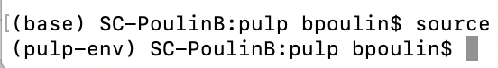
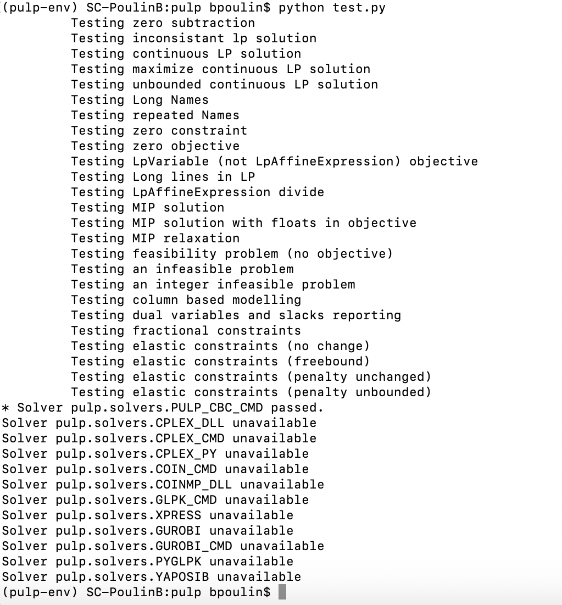

# Get the Files from the Commandline

downoad the entire repistory and save it to your documents folder

`git clone https://github.com/bpoulin-CUNY/linear-programming.git`

# Create a Stable Work Environment

Because PulP only runs on Python 2.7, for those of you, like me, who protect our stable Python 3 system virulently will want to isolate the Python 2.7 instance, a conda environment is the perfect way to do this.

We will do this from the command terminal in Mac and Linux environments and from a bask console in PC.

## Installing a Conda Environment

### Start with by updating `conda` 

`conda update conda`

### Installing Dedicated Environment

`conda create -n pulp-env python=2.7 anaconda`

In this we are using `conda create` to tell the terminal what you want it to do.

 we give the environment a name using `-n pulp-env`, this makes calling and activating the environment possible for future use.
 
 `python=2.7 anaconda` directs anaconda to build an evirnment with the specific version of python (you could change the numbers to 2.6, 3.3, 3.5 or any other legitimate version if you wanted but Pulp requires 2.7)
 
## Setting up Your New Environment

### Activating your `pulp-env`. 
In order to insall pulp, you need to have the environ
ment active when you install `Pulp`

You can do this using: 

`source activate pulp-env`

After activating your terminal display will change, showing your current work directory preceded by `(pulp-env)` the name of your environment.    

.  

If you do not see this you may need to do some problem-solving, but be sure that your Python 2.7 environment is active before you install Pulp.

### Installing Pulp

`pip install pulp`

You should see the termininal instaling a bunch of things, when it stops you should be ready to go.

### From the Pulp Directory Call the test file
 python test.py
 
 If everything works out as it should, you will see something like this:

**If you saw something along the lines of the output above, you are good to go!**. 

### Open Jupyter Notebook

` jupyter notebook`

A browser page should open up, create a new jupyter notebook and in the first cell type `import pulp`

if it runs, the `*` disappears next to the cell then disappears and nothing appears to happen, you are all set to go.

If, instead you get the output:

`ModuleNotFoundError: No module named 'pulp'`
 
##  Open Jupyter Test Notebook & Learn Some PulP

It is a good idea to run this test notebook, line by line prior to engaging in an serious linear programming adventures to be sure that you have a proper environment.

`pulp-test-notebook.ipynb`
